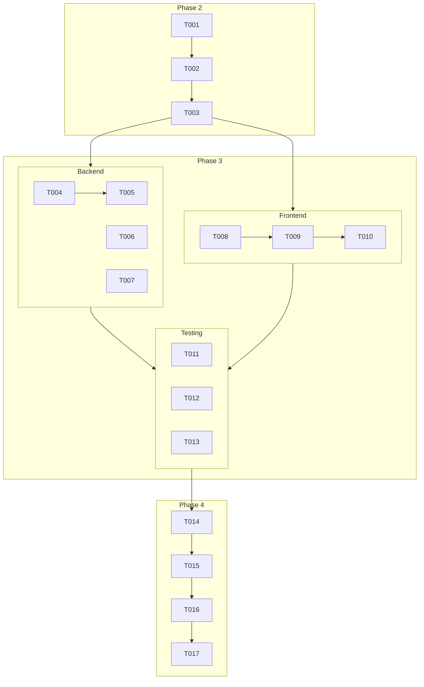

# Actionable Tasks: Toggle Average Cost Calculation Mode

This file breaks down the implementation of the "Toggle Average Cost Calculation Mode" feature into a series of actionable, dependency-ordered tasks.

## Phase 1: Setup

*No project setup tasks are required as this feature is being added to an existing project.*

## Phase 2: Foundational (Database)

- [X] T001 Update the Drizzle schema for the `bodegas` table to include the `auto_update_average_cost` boolean field with a default of `false` in `src/lib/drizzle/schemas/bodegas.ts`.
- [X] T002 Generate the database migration script using the Drizzle Kit command `drizzle-kit generate`.
- [X] T003 Apply the newly generated migration to the database. (This may be a manual step depending on the deployment process).

## Phase 3: User Story 1 - Configure Warehouse Average Cost Mode

**Goal**: A warehouse manager can switch the average cost calculation method between "Automatic" and "Manual" for each warehouse.

**Independent Test**: Navigate to a warehouse details page, toggle the "Automatic Update" switch, and verify the setting is saved. Then, create an inbound movement for an item in that warehouse and confirm that the average cost is updated (or not) according to the selected mode.

### Backend Tasks

- [X] T004 [US1] Create a repository method in `src/lib/dal/repositories/bodegas.repository.ts` to update the `auto_update_average_cost` flag for a specific warehouse.
- [X] T005 [P] [US1] Implement the `PATCH /api/bodegas/[id]` API route in `src/app/api/bodegas/[id]/route.ts` to handle updating the `auto_update_average_cost` flag.
- [X] T006 [US1] Modify the inbound movement logic in `src/lib/dal/services/movements.service.ts` to conditionally execute the average cost calculation based on the `auto_update_average_cost` flag of the warehouse.
- [X] T007 [P] [US1] Add logging for failed automatic average cost calculations within `src/lib/dal/services/movements.service.ts` as per FR-009.

### Frontend Tasks

- [X] T008 [P] [US1] Create a new UI component, `WarehouseCostModeToggle`, in `src/components/warehouses/warehouse-cost-mode-toggle.tsx`. This component will contain the `Switch` and handle the API call.
- [X] T009 [US1] Integrate the `WarehouseCostModeToggle` component into the warehouse details page at `src/app/(dashboard)/warehouses/[id]/page.tsx`.
- [X] T010 [US1] Implement the client-side logic within the `WarehouseCostModeToggle` component to call the `PATCH` API endpoint and handle loading/error states (show an error message on failure, no notification on success).

### Testing Tasks

- [X] T011 [P] [US1] Write a unit test for the movement service (`src/lib/dal/services/movements.service.ts`) to verify that the cost calculation is correctly skipped or executed based on the warehouse's setting.
- [X] T012 [P] [US1] Write an integration test for the `PATCH /api/bodegas/[id]` endpoint.
- [X] T013 [US1] Write an end-to-end (E2E) test using Playwright to simulate a user toggling the switch and verifying the outcome.

## Phase 4: Polish & Cross-Cutting Concerns

- [X] T014 Review all code for clarity, performance, and adherence to project conventions.
- [X] T015 Manually test the end-to-end flow to ensure it meets all acceptance criteria from `spec.md`.
- [X] T016 Remove any feature flags or temporary code.
- [X] T017 Merge the feature branch into the main development branch.

## Dependencies

The implementation is structured around a single user story (US1). All tasks in **Phase 3** are part of this user story and can be worked on after **Phase 2** is complete.

## Parallel Execution

- Within Phase 3, backend (T005-T007) and frontend (T008-T010) tasks can be developed in parallel after the foundational database changes are made.
- Testing tasks (T011, T012) can be worked on in parallel with development if interfaces are agreed upon.

## Implementation Strategy

The feature will be delivered in a single increment corresponding to User Story 1. The suggested MVP is the completion of all tasks in Phase 3.
