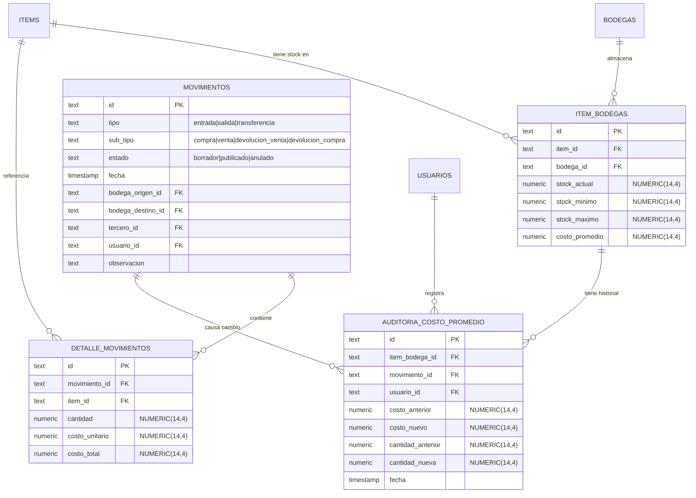
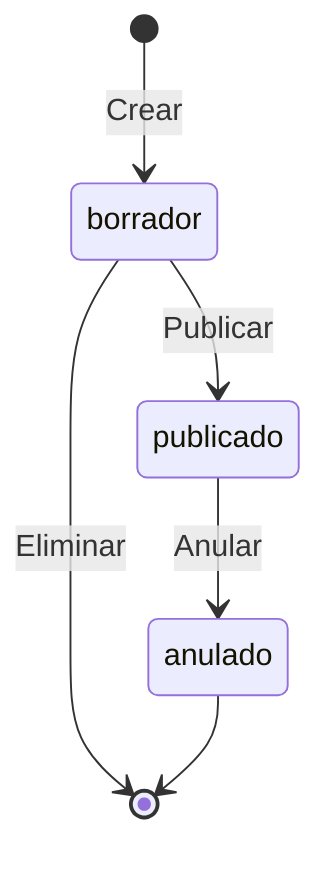
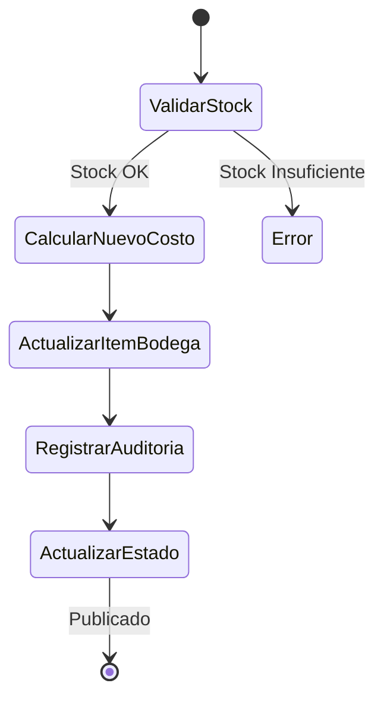

# Data Model: Método de Valoración Promedio Ponderado

**Feature**: 003-weighted-average-costing
**Date**: 2026-01-16

## Entity Relationship Diagram



## New Entity: auditoria_costo_promedio

### Purpose
Registrar cada cambio en el costo promedio de un ítem en una bodega para trazabilidad y auditoría contable.

### Schema Definition (Drizzle)

```typescript
// src/lib/drizzle/schemas/auditoria-costo-promedio.ts
import { pgTable, text, timestamp, numeric, index } from "drizzle-orm/pg-core";
import { itemBodegas } from "./item-bodegas";
import { movimientos } from "./movimientos";
import { user } from "./auth-schema";

export const auditoriaCostoPromedio = pgTable(
  "auditoria_costo_promedio",
  {
    id: text("id").primaryKey().$defaultFn(() => crypto.randomUUID()),

    // Referencias
    itemBodegaId: text("item_bodega_id")
      .notNull()
      .references(() => itemBodegas.id, { onDelete: "cascade" }),
    movimientoId: text("movimiento_id")
      .notNull()
      .references(() => movimientos.id, { onDelete: "cascade" }),
    usuarioId: text("usuario_id")
      .notNull()
      .references(() => user.id, { onDelete: "set null" }),

    // Valores de auditoría
    costoAnterior: numeric("costo_anterior", { precision: 14, scale: 4 }).notNull(),
    costoNuevo: numeric("costo_nuevo", { precision: 14, scale: 4 }).notNull(),
    cantidadAnterior: numeric("cantidad_anterior", { precision: 14, scale: 4 }).notNull(),
    cantidadNueva: numeric("cantidad_nueva", { precision: 14, scale: 4 }).notNull(),

    // Metadata
    fecha: timestamp("fecha", { withTimezone: true }).notNull().defaultNow(),
  },
  (table) => ({
    itemBodegaIdx: index("auditoria_costo_item_bodega_idx").on(table.itemBodegaId),
    movimientoIdx: index("auditoria_costo_movimiento_idx").on(table.movimientoId),
    fechaIdx: index("auditoria_costo_fecha_idx").on(table.fecha),
  })
);
```

### Fields Description

| Field | Type | Nullable | Description |
|-------|------|----------|-------------|
| `id` | TEXT | No | UUID primary key |
| `itemBodegaId` | TEXT | No | FK to item_bodegas, cascades on delete |
| `movimientoId` | TEXT | No | FK to movimientos, cascades on delete |
| `usuarioId` | TEXT | No | FK to user who published the movement |
| `costoAnterior` | NUMERIC(14,4) | No | Cost before the change |
| `costoNuevo` | NUMERIC(14,4) | No | Cost after the change |
| `cantidadAnterior` | NUMERIC(14,4) | No | Stock quantity before |
| `cantidadNueva` | NUMERIC(14,4) | No | Stock quantity after |
| `fecha` | TIMESTAMP | No | When the change occurred |

---

## Modified Entity: movimientos

### New Field: sub_tipo

```typescript
// Add to existing movimientos schema
subTipo: text("sub_tipo"), // "compra" | "venta" | "devolucion_venta" | "devolucion_compra" | null
```

### SubTipo Values

| tipo | sub_tipo | Description |
|------|----------|-------------|
| entrada | compra | Purchase from supplier (RECALCULATES) |
| entrada | devolucion_venta | Customer return (NO recalculate) |
| salida | venta | Sale to customer |
| salida | devolucion_compra | Return to supplier |
| transferencia | null | Transfer between warehouses |

---

## Modified Entity: item_bodegas

### Existing Fields (No Changes Required)

The `item_bodegas` table already has the necessary fields:
- `costoPromedio: NUMERIC(14,4)` - Current weighted average cost
- `stockActual: NUMERIC(14,4)` - Current stock quantity

### New Repository Method

```typescript
// Add to item-bodegas.repository.ts
async actualizarCostoPromedio(
  itemId: string,
  bodegaId: string,
  nuevoCostoPromedio: number,
  nuevaCantidad: number
): Promise<ItemBodega>
```

---

## Validation Rules

### Movement Publication Validation

1. **Stock validation** (for salida and devolucion_compra):
   ```typescript
   if (tipo === "salida" || subTipo === "devolucion_compra") {
     const stockDisponible = await getStock(itemId, bodegaId);
     if (cantidad > stockDisponible) {
       throw new Error(`Stock insuficiente: ${stockDisponible} disponibles`);
     }
   }
   ```

2. **Cost validation** (for entrada-compra):
   ```typescript
   if (tipo === "entrada" && subTipo === "compra") {
     if (costoUnitario === undefined || costoUnitario < 0) {
       throw new Error("El costo unitario es requerido para compras");
     }
   }
   ```

3. **Transfer validation**:
   ```typescript
   if (tipo === "transferencia") {
     if (bodegaOrigenId === bodegaDestinoId) {
       throw new Error("Bodega origen y destino deben ser diferentes");
     }
   }
   ```

---

## State Transitions

### Movement States



### Cost Recalculation Trigger



---

## Calculated Fields

### Kárdex View Calculations

For each movement in chronological order:

```typescript
interface KardexCalculation {
  // Running totals (calculated, not stored)
  existenciaCantidad: number;      // Previous + entrada - salida
  existenciaCostoPromedio: number; // Recalculated only on entrada-compra
  existenciaValor: number;         // cantidad × costoPromedio
}
```

### Weighted Average Formula

```typescript
function calcularNuevoPromedio(
  cantidadActual: number,
  costoPromedioActual: number,
  cantidadEntrada: number,
  costoUnitarioEntrada: number
): number {
  const valorActual = cantidadActual * costoPromedioActual;
  const valorEntrada = cantidadEntrada * costoUnitarioEntrada;
  const nuevaCantidad = cantidadActual + cantidadEntrada;

  if (nuevaCantidad === 0) return 0;

  return (valorActual + valorEntrada) / nuevaCantidad;
}
```

---

## Indexes

### New Indexes for auditoria_costo_promedio

| Index Name | Columns | Purpose |
|------------|---------|---------|
| `auditoria_costo_item_bodega_idx` | `item_bodega_id` | Query history by item+warehouse |
| `auditoria_costo_movimiento_idx` | `movimiento_id` | Link audit to movement |
| `auditoria_costo_fecha_idx` | `fecha` | Time-based queries |

### Recommended Additional Indexes

| Table | Index | Columns | Purpose |
|-------|-------|---------|---------|
| `detalle_movimientos` | `detalle_item_idx` | `item_id` | Kardex queries by item |
| `movimientos` | `movimientos_tipo_idx` | `tipo` | Filter by movement type |

---

## Migration Plan

### Migration: Add sub_tipo to movimientos

```sql
-- 0006_add_subtipo_movimientos.sql
ALTER TABLE movimientos
ADD COLUMN sub_tipo TEXT;

-- Backfill existing data
UPDATE movimientos
SET sub_tipo = CASE
  WHEN tipo = 'entrada' THEN 'compra'
  WHEN tipo = 'salida' THEN 'venta'
  ELSE NULL
END
WHERE sub_tipo IS NULL AND estado = 'publicado';
```

### Migration: Create auditoria_costo_promedio

```sql
-- 0007_create_auditoria_costo_promedio.sql
CREATE TABLE auditoria_costo_promedio (
  id TEXT PRIMARY KEY,
  item_bodega_id TEXT NOT NULL REFERENCES item_bodegas(id) ON DELETE CASCADE,
  movimiento_id TEXT NOT NULL REFERENCES movimientos(id) ON DELETE CASCADE,
  usuario_id TEXT NOT NULL REFERENCES "user"(id) ON DELETE SET NULL,
  costo_anterior NUMERIC(14,4) NOT NULL,
  costo_nuevo NUMERIC(14,4) NOT NULL,
  cantidad_anterior NUMERIC(14,4) NOT NULL,
  cantidad_nueva NUMERIC(14,4) NOT NULL,
  fecha TIMESTAMP WITH TIME ZONE NOT NULL DEFAULT NOW()
);

CREATE INDEX auditoria_costo_item_bodega_idx ON auditoria_costo_promedio(item_bodega_id);
CREATE INDEX auditoria_costo_movimiento_idx ON auditoria_costo_promedio(movimiento_id);
CREATE INDEX auditoria_costo_fecha_idx ON auditoria_costo_promedio(fecha);
```
