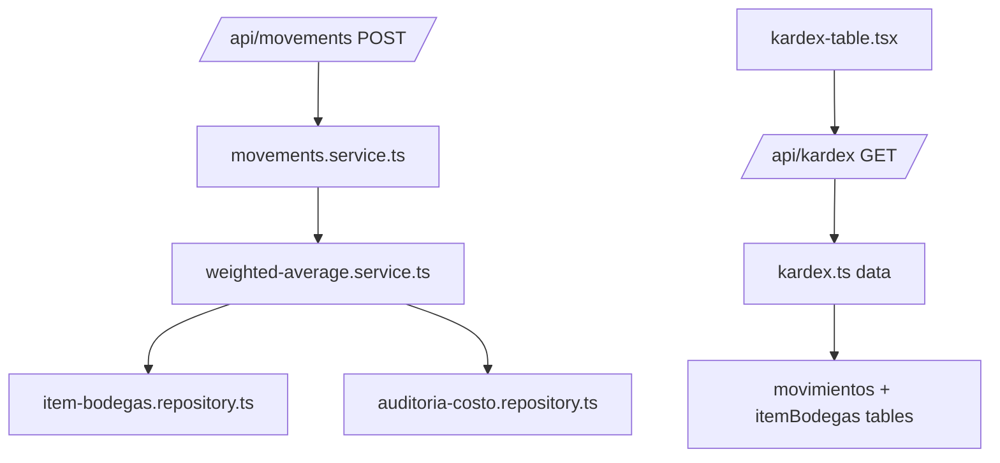

# Implementation Plan: Método de Valoración Promedio Ponderado

**Branch**: `003-weighted-average-costing` | **Date**: 2026-01-16 | **Spec**: [spec.md](./spec.md)
**Input**: Feature specification from `/specs/003-weighted-average-costing/spec.md`

## Summary

Implementar el método de valoración de inventario por **Promedio Ponderado** en el sistema Kárdex. El costo promedio se recalcula automáticamente en cada entrada de compra usando la fórmula `(Valor Existencia + Valor Entrada) / (Cant. Existencia + Cant. Entrada)`. Las salidas, devoluciones y transferencias usan el costo promedio actual sin recalcularlo. Se requiere una vista tipo Tarjeta Kárdex con histórico de movimientos, filtros, paginación, exportación CSV y auditoría de cambios de costo.

## Technical Context

**Language/Version**: TypeScript 5.x / Node.js 20.x
**Primary Dependencies**: Next.js 16.1.1, React 19.2.3, Drizzle ORM 0.41.0, Zod 4.3.5, better-auth 1.4.10
**Storage**: PostgreSQL (via Drizzle ORM) - tablas existentes: `movimientos`, `detalleMovimientos`, `itemBodegas`
**Testing**: Vitest (configurado en proyecto)
**Target Platform**: Web (Next.js App Router)
**Project Type**: Web application (fullstack Next.js)
**Performance Goals**: Paginación 100 registros/página, respuesta < 500ms
**Constraints**: Precisión 4 decimales (NUMERIC 14,4), diferencia máxima $0.01 por redondeo
**Scale/Scope**: Sistema de inventario multi-bodega, ~1000 ítems, ~10000 movimientos/mes

## Constitution Check

*GATE: Must pass before Phase 0 research. Re-check after Phase 1 design.*

El proyecto no tiene principios específicos definidos en constitution.md (archivo con placeholders).
Se aplicarán las convenciones establecidas en el proyecto:

- [x] **Arquitectura en capas**: Schema → Repository → Service → Data → API → Components
- [x] **Validación con Zod**: Esquemas en `src/lib/validators/`
- [x] **Patrón Repository**: Acceso a datos en `src/lib/dal/repositories/`
- [x] **Permisos por acción**: Sistema `movements:read`, `movements:write`
- [x] **Nomenclatura**: Español para lógica de negocio, inglés para código técnico

## Project Structure

### Documentation (this feature)

```text
specs/003-weighted-average-costing/
├── plan.md              # This file
├── research.md          # Phase 0 output
├── data-model.md        # Phase 1 output
├── quickstart.md        # Phase 1 output
├── contracts/           # Phase 1 output
│   └── kardex-api.yaml  # OpenAPI spec
└── tasks.md             # Phase 2 output (/speckit.tasks)
```

### Source Code (repository root)

```text
src/
├── app/
│   ├── (dashboard)/
│   │   └── kardex/
│   │       └── page.tsx                    # Vista Kárdex (modificar)
│   └── api/
│       └── kardex/
│           ├── route.ts                    # GET listado Kárdex
│           └── export/
│               └── route.ts                # GET exportar CSV
├── components/
│   └── kardex/
│       ├── kardex-table.tsx                # Tabla tipo Tarjeta Kárdex
│       ├── kardex-filters.tsx              # Filtros: fecha, bodega, tipo
│       └── kardex-empty-state.tsx          # Estado vacío
├── lib/
│   ├── dal/
│   │   ├── repositories/
│   │   │   ├── item-bodegas.repository.ts  # Agregar actualizarCostoPromedio()
│   │   │   └── auditoria-costo.repository.ts # NUEVO: Log auditoría
│   │   └── services/
│   │       ├── movements.service.ts        # Modificar publicarMovimiento()
│   │       └── weighted-average.service.ts # NUEVO: Lógica promedio ponderado
│   ├── data/
│   │   └── kardex.ts                       # NUEVO: Queries vista Kárdex
│   ├── drizzle/
│   │   └── schemas/
│   │       └── auditoria-costo-promedio.ts # NUEVO: Schema tabla auditoría
│   ├── validators/
│   │   └── kardex.ts                       # NUEVO: Validadores consulta
│   └── types/
│       └── kardex.ts                       # NUEVO: Tipos vista Kárdex
└── hooks/
    └── kardex/
        └── use-kardex-filters.ts           # NUEVO: Hook filtros URL
```

**Structure Decision**: Se extiende la estructura web existente. Los cambios principales son:
1. Nuevo servicio `weighted-average.service.ts` con la lógica de cálculo
2. Nueva tabla `auditoria_costo_promedio` para log de cambios
3. Nuevos endpoints API para consulta Kárdex y exportación CSV
4. Modificación del flujo de publicación de movimientos para recalcular costos

## Complexity Tracking

> No hay violaciones de Constitution que justificar.

| Aspecto | Decisión | Justificación |
|---------|----------|---------------|
| Servicio separado | `weighted-average.service.ts` | Encapsula lógica de cálculo, facilita testing unitario |
| Tabla auditoría | Nueva tabla dedicada | Requerimiento FR-015, historial de cambios de costo |
| Vista Kárdex | API dedicada `/api/kardex` | Query compleja con joins y cálculos, evita sobrecargar `/api/movements` |

## Dependencies Between Components



## Risk Analysis

| Riesgo | Probabilidad | Impacto | Mitigación |
|--------|--------------|---------|------------|
| Precisión decimal en cálculos | Media | Alto | Usar NUMERIC(14,4) y test con valores del libro |
| Performance en histórico largo | Media | Medio | Paginación obligatoria, índices en fecha |
| Concurrencia en publicación | Baja | Alto | Transacciones atómicas en DB |
| Migración datos existentes | Baja | Medio | Los movimientos existentes no tienen costoPromedio, se calculará en primera entrada |

## Implementation Phases

### Phase 1: Core - Cálculo Promedio Ponderado
- Schema tabla auditoría
- Servicio weighted-average con fórmula
- Integración con publicación de movimientos
- Tests unitarios con valores del libro

### Phase 2: Vista Kárdex
- API endpoint `/api/kardex`
- Componentes UI (tabla, filtros)
- Paginación y estado vacío

### Phase 3: Exportación y Auditoría
- Endpoint exportación CSV
- Vista de log de cambios de costo
- Tests de integración

### Phase 4: Transferencias
- Lógica especial: costo origen como entrada en destino
- Validaciones adicionales
